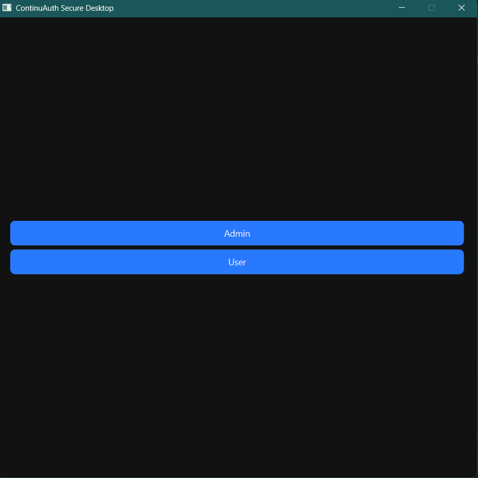
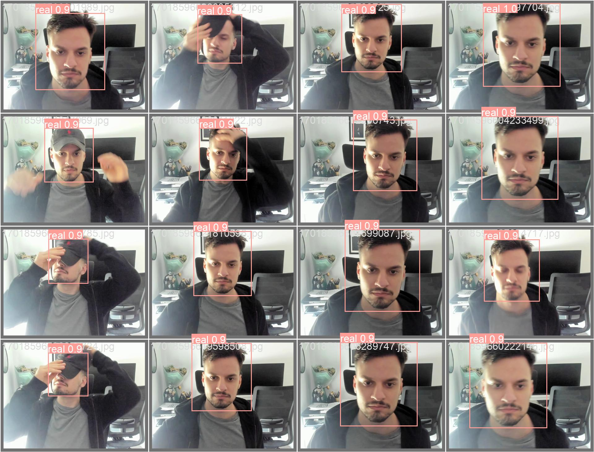
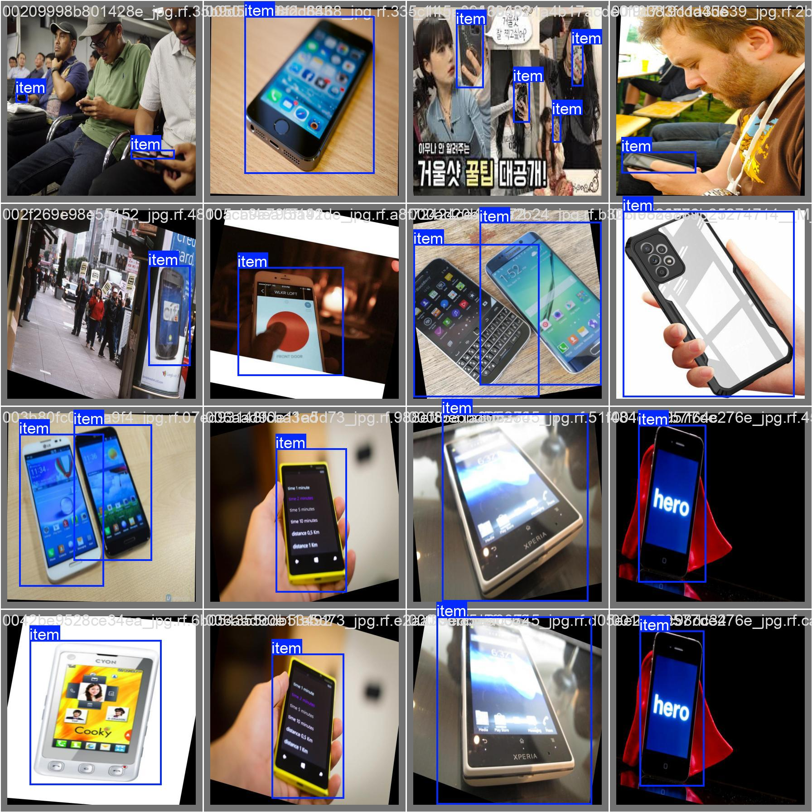
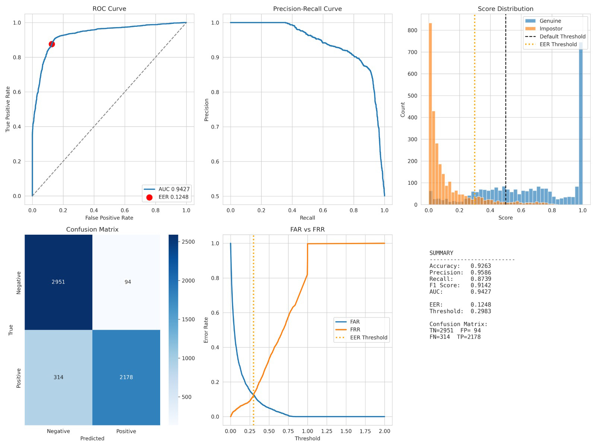

# ContinuAuth

ContinuAuth is a face authentication system built with PyQt6 that combines face recognition, liveness detection, and secure user verification. The application uses ARC-Face embeddings for identity matching and incorporates anti-spoofing measures to improve authentication reliability. Face data can be stored securely in MongoDB, with automatic local storage fallback when database connectivity is unavailable.

## Features

* Real-time face recognition using ARC-Face embeddings
* Liveness detection to reduce spoofing attempts
* Phone detection during authentication using YOLOv5
* Secure storage of encrypted face embeddings
* Automatic local storage fallback when MongoDB is unavailable
* Security event logging and violation tracking
* NVIDIA GPU acceleration support with CPU fallback

## Interface & Evaluation Results

### Authentication Interface


### Anti spoofing Evaluation Results


### Phone Detection Evaluation Results


### Face verification Performance Metrics


## Requirements

* Python 3.10 or later
* MongoDB Atlas account (optional but recommended)
* NVIDIA GPU (optional)

## Installation

1. Install project dependencies:

```bash
pip install -r requirements.txt
```

2. Create the environment configuration file:

```bash
cp .env.example .env
```

3. Update the `.env` file with your MongoDB connection details and encryption key.

4. Start the application:

```bash
python main.py
```

## Project Structure

```text
├── main.py
├── requirements.txt
├── .env
│
├── models/
│   ├── glintr100.onnx
│   ├── best_model_quantized.onnx
│   ├── detector_quantized.onnx
│   ├── best_v5.pt
│   ├── scaler_mean.npy
│   └── scaler_scale.npy
│
├── src/
│   ├── detection/
│   ├── inference/
│   ├── minifasv2/
│   └── mobilenetv4/
│
├── dataset/
├── logs/
├── violations_evidence/
├── local_storage/
│
└── MODEL_FILES_REFERENCE.md
```

## Configuration

Example `.env` configuration:

```ini
# MongoDB
MONGO_URI=<your_mongodb_uri>
MONGO_DB_NAME=continuauth

# Encryption
ENCRYPTION_KEY=<your_encryption_key>

# Application Settings
VIOLATION_RETENTION_DAYS=30
SCREENSHOT_FOLDER=violations_evidence
LOG_FOLDER=logs
```

To generate a new encryption key:

```bash
python -c "from cryptography.fernet import Fernet; print(Fernet.generate_key().decode())"
```

## Data Storage

ContinuAuth supports a dual-storage approach to improve reliability.

### MongoDB Storage

Face embeddings are encrypted and stored in MongoDB when a database connection is available.

### Local Storage Fallback

If MongoDB becomes unavailable due to network issues or configuration problems, the application automatically stores data locally in the `local_storage/` directory. This allows authentication services to continue operating without interruption.

## Security

### Data Protection

* Face embeddings are encrypted using Fernet encryption
* Raw face images are not stored in the database
* Sensitive credentials are managed through environment variables

### Monitoring and Logging

* Authentication violations are recorded for auditing purposes
* Screenshot evidence is stored in `violations_evidence/`
* System logs and verification records are stored in `logs/`
* Old violation records can be automatically removed based on the configured retention period

## Troubleshooting

### Unable to Connect to MongoDB

If the application cannot connect to MongoDB:

1. Verify that the `MONGO_URI` value is correct.
2. Confirm that your IP address is allowed in MongoDB Atlas network settings.
3. Ensure that the database service is running and accessible.

The application will automatically switch to local storage if the connection cannot be established.

### Face Detection Issues

If face detection fails:

1. Ensure adequate lighting conditions.
2. Position your face directly in front of the camera.
3. Maintain sufficient image quality and distance from the camera.

## Adding Screenshots & Evaluation Results

To add your own images showcasing the system:

1. **Place images in `assets/images/` folder:**
   - `authentication_interface.png` - Main UI screenshot
   - `evaluation_results.png` - Model accuracy, precision, recall charts
   - `face_detection_demo.png` - Sample face detection output
   - `performance_metrics.png` - System performance graphs

2. **Image Specifications:**
   - **Size**: 1280x720 or 1920x1080 for UI screenshots, 800x600 or higher for charts
   - **Format**: PNG or JPG recommended
   - **Quality**: High resolution for clarity

3. **After adding images, commit and push:**
   ```bash
   git add assets/images/
   git commit -m "Add screenshots and evaluation results"
   git push origin main
   ```

## License

This project is intended for educational and research purposes.

---

Last Updated: 2026
